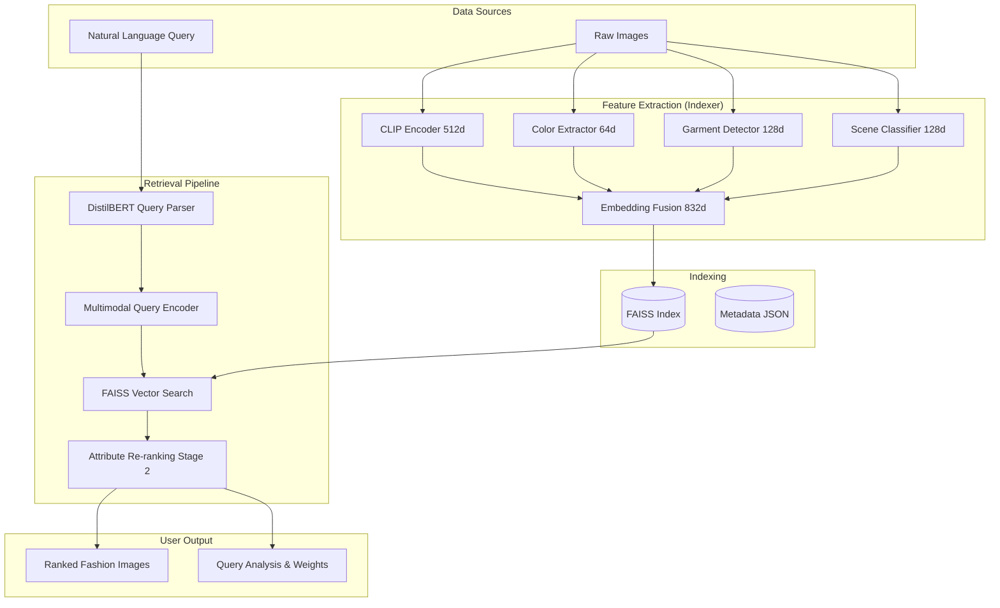

<div align="center">
  
  <h1>🛍️ Multimodal Fashion Context Retrieval</h1>
  <p><b>State-of-the-art semantic search for fashion using Multimodal Fusion & Two-Stage Retrieval</b></p>
  
  [](https://www.python.org/downloads/)
  [](https://pytorch.org/get-started/locally/)
  [](https://github.com/openai/CLIP)
  [](https://streamlit.io/)
  
</div>

---

##  Overview
This repository implements a **Multimodal Fashion Context Retrieval System** designed to bridge the gap between natural language descriptions and visual fashion attributes. Unlike traditional keyword-based search, this system understands **global semantic context** (CLIP) alongside **granular attributes** like colors, specific garments, and scene locations.
### Key Capabilities:
- **🧠 Semantic Understanding**: Detects intent like *"Professional business attire"* or *"Casual weekend outfit"*.
- **🎨 Attribute-Aware Fusion**: Dynamically weights color, garment, and scene features based on query characteristics.
- **⚡ Two-Stage Retrieval**: Combines fast vector search (FAISS) with an intensive attribute-based re-ranking stage.
- **🗣️ Natural Language Parsing**: Uses `DistilBERT` to extract specific constraints from messy user queries.
---
## 🏗️ Architecture
The system uses an **832-dimensional fused embedding space**, combining global and local features for maximum precision.

---
## 🛠️ Tech Stack
- **Computer Vision**: OpenAI CLIP (ViT-B/32)
- **NLP**: HuggingFace Transformers (DistilBERT-SQuAD)
- **Vector Engine**: FAISS (Facebook AI Similarity Search)
- **Web App**: Streamlit
- **Processing**: PyTorch, OpenCV, Pillow
  
---

## 🚀 Installation & Local Setup
Follow these steps to clone the repository and set up the system on your local machine.
### 1. Clone the Repository
Open your terminal and run:
```bash
# Clone the repository from GitHub
git clone https://github.com/Yashwanth-79/Multimodal-Fashion-Context-Retrieval.git
# Navigate into the project directory
cd Multimodal-Fashion-Context-Retrieval
```
### 2. Set Up Environment (Recommended)
It is highly recommended to use a virtual environment to avoid dependency conflicts.
**On Windows:**
```bash
python -m venv venv
.\venv\Scripts\activate
```
**On Linux/macOS:**
```bash
python3 -m venv venv
source venv/bin/activate
```
### 3. Install Dependencies
```bash
# Install core requirements
pip install -r requirements.txt
```
### 4. Data Preparation
- Ensure you have a set of images you want to search through.
- Create a folder `data/raw/` if it doesn't exist.
- Copy your images into `data/raw/`.
---
## 🏃 Running the Pipeline
Once the setup is complete, you can run the following components:
### A. Indexing (Build the Searchable Database)
Extract features and build the FAISS index:
```bash
python run_pipeline.py
```
*Note: This will process all images in `data/raw/` and save the index to `data/processed/`.*
### B. Interactive Web UI
Launch the beautiful Streamlit search interface:
```bash
streamlit run app.py
```
This will open the application in your default web browser (usually at `http://localhost:8501`).
---
## 🧪 Methodology: adaptive Multi-Modal Fusion
Our system doesn't just treat all features equally. It uses **Adaptive Query-Specific Weighting**:
- **General Queries**: Defaults to CLIP-heavy search for broad semantic understanding.
- **Attribute Queries**: If you search for *"bright yellow raincoat"*, the system automatically boosts the **Color** and **Garment** weights to 35%+, ensuring visual precision.
- **Compositional Queries**: Complexity detection triggers a **Two-Stage Retrieval** where the top 50 candidates are re-scored using explicit attribute matching.
---
## 📁 Project Structure
```text
├── indexer/          # Feature extraction & vector building
├── models/           # Encoders for CLIP, Color, Garment, and Scene
├── retriever/        # Query parsing & search logic
├── utils/            # Configurations & logging
├── data/             # Raw images and processed FAISS bits
├── app.py            # Streamlit Web UI
└── run_pipeline.py   # CLI entry point
```
---
<div align="center">
  Developed by <a href="https://github.com/Yashwanth-79">Yashwanth-79</a>
</div>
